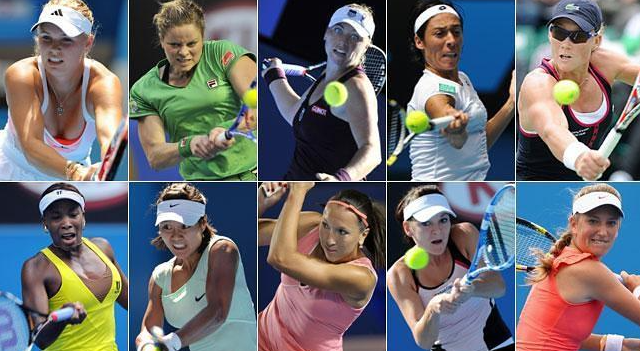

[← Volver al inicio](README.md)
 # Temas del curso

### 16/09 · Mis aficiones

Llevo practicando tenis desde los seis años ya que toda
mi familia lo jugó en algún momento de sus vidas. Lo que más
me gusta es el momento en que por fin corriges un error
que te pasaba factura y comienzas a ver un progreso rápido.
Aunque jugar a veces sea frustrante, para mí es una forma
de desconectar del día a día y solo pensar en el presente.

Buscando en GitHub he encontrado [tennis_analysis](https://github.com/abdullahtarek/tennis_analysis),
un programa libre que analiza a los tenistas en un vídeo para estudiar su velocidad, potencia de tiro y cantidad de golpes.

---

### 28/09 · Premios Princesa de Asturias: Leo Messi

El futbolista argentino Lionel Messi será premiado con el Premio Princesa
de Asturias de los Deportes 2026 por la Fundación Princesa de Asturias.
[su página en la Fundación](https://www.fpa.es/es/premios-princesa-de-asturias/premiados/2026-leo-messi/?texto=trayectoria)
Será galardonado por su labor tanto profesionalmente como socialmente, 
ya que se preocupó de forma activa por la salud y la educación de los
niños desfavorecidos. Le elegí porque es una persona muy influyente
actualmente que transmite valores positivos como el esfuerzo, la
empatía o la superación personal.

Imagen: AUTOR, [Wikimedia Commons](https://commons.wikimedia.org/...)

---
